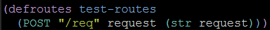
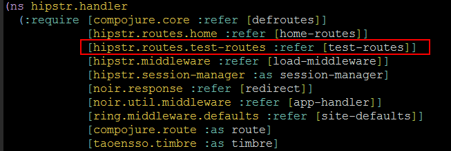
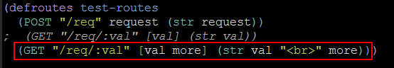
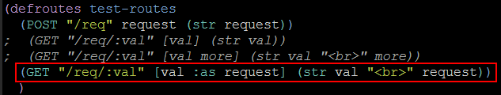
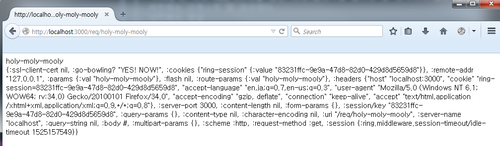
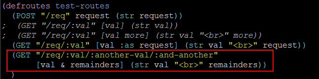
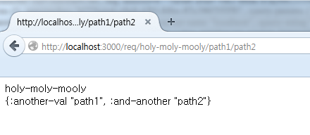
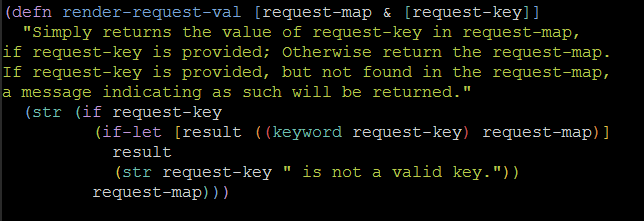
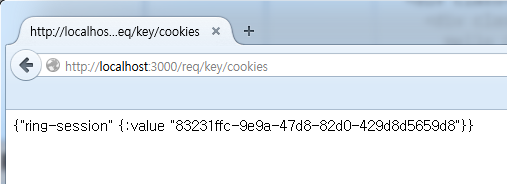

<h2>Table of Contents</h2>

<ul>
<li><a href="#sec-1">1. Compojure 란?</a></li>
<li><a href="#sec-2">2. 실습 : Compojure route 만들기</a></li>
<li><a href="#sec-3">3. defroutes 사용하기</a>
<ul>
<li><a href="#sec-3-1">3.1. 실습 : test_routes 추가</a></li>
</ul>
</li>
<li><a href="#sec-4">4. route 해부하기</a>
<ul>
<li><a href="#sec-4-1">4.1. route의 구조</a></li>
<li><a href="#sec-4-2">4.2. 파라메터 구조분해(destructuring) 하기</a>
<ul>
<li><a href="#sec-4-2-1">4.2.1. 쿼리 스트링 포함하기</a></li>
</ul>
</li>
<li><a href="#sec-4-3">4.3. 요청(request)을 구조분해 하기</a></li>
<li><a href="#sec-4-4">4.4. 파라메터의 잔여부분 참조</a></li>
<li><a href="#sec-4-5">4.5. response 만들기</a></li>
<li><a href="#sec-4-6">4.6. 복잡한 response 만들기</a></li>
</ul>
</li>
<li><a href="#sec-5">5. Selmer</a>
<ul>
<li><a href="#sec-5-1">5.1. 변수</a></li>
<li><a href="#sec-5-2">5.2. Filter</a>
<ul>
<li><a href="#sec-5-2-1">5.2.1. safe filter</a></li>
<li><a href="#sec-5-2-2">5.2.2. default filter</a></li>
</ul>
</li>
<li><a href="#sec-5-3">5.3. Tags</a></li>
<li><a href="#sec-5-4">5.4. 실습 : 서버 페이지 만들어보기</a>
<ul>
<li><a href="#sec-5-4-1">5.4.1. 메인화면에서 가입폼 이동 링크 작성</a></li>
<li><a href="#sec-5-4-2">5.4.2. 가입폼 작성</a></li>
<li><a href="#sec-5-4-3">5.4.3. 가입폼으로 이동하는 route를 추가</a></li>
</ul>
</li>
</ul>
</li>
</ul>

# Compojure 란?

-   하이레벨 웹 어플리케이션 프레임워크 (or 라이브러리)
-   핸들러 메서드를 작성하기 쉽게 해준다.
-   HTTP Method A 로 URL B 를 요청하면 Clojure function C 를 실행해라.

# 실습 : Compojure route 만들기

-   home.clj 파일을 연다.
-   home-routes 에 req 를 추가한다.

-   Ring Server 를 시작한다. (lein ring server)
-   <http://localhost:3000/req> 로 접속해본다.

# defroutes 사용하기

-   defroutes 는 매크로
-   실행되면 등록된 모든 routes 를 모아서 그 것들을 처리하기 위한 하나의 큰 Ring handler를 만들어 준다.
-   test\_routes 를 추가해보면서 이 메커니즘을 이해해보자.

## 실습 : test\_routes 추가

-   /hipstr/routes/test\_routes.clj 를 만들고 네임스페이스 설정을 추가

-   defroutes 매크로를 사용해서 새로운 route를 생성

-   handler 네임스페이스에 test-routes를 추가 (handler.clj)

-   app에 test-routes를 추가해준다. (handler.clj)

# route 해부하기

## route의 구조

    [HTTP_METHOD] [URL] [Request & PARAMETER] [Response] ; 문법
    ANY "/req" request (str request))  ; 예

-   ANY는 모든 HTTP METHOD에 대해 동작한다는 의미
-   "/req"는 해당 URL (주의할 점은 뒤에 슬래시를 붙이면 잘 동작하지 않는 경우가 많다는 것)
-   세번째는 리퀘스트 및 파라메터
-   네번째는 응답

## 파라메터 구조분해(destructuring) 하기

-   컴포저의 구조분해 문법은 HTTP 요청 파라메터를 같은 이름의 변수명에 바인드해 준다.
-   예를 들어, 다음 예에서 :val 은 요청의 :params 맵이 된다.

### 쿼리 스트링 포함하기

새로운 경로 `(GET "/req/:val" [val more] (str val " " more))` 를 추가하고 기존의 경로는 주석처리한다. (주석처리 하지 않으면 동일한 URL이므로 위의 경로가 적용된다.)

파라메터 중에서 이름이 more인 것이 있으면 다음과 같이 응답에 출력해준다.

## 요청(request)을 구조분해 하기

-   요청자체에 접근하고 싶을 때는?
-   **:as** 를 사용한다.

## 파라메터의 잔여부분 참조

-   파라메터의 잔여부분은 & 를 이용해서 참조할 수 있다.

## response 만들기

-   응답에는 str함수뿐만 아니라 다양한 클로저 함수를 사용할 수 있다.

## 복잡한 response 만들기

-   복잡한 응답을 만들어 내기 위해서 Selmer가 필요하다!

# Selmer

-   클로저의 템플릿 시스템
-   장고에 많은 영향을 받은 HTML 템플릿 엔진

## 변수

-   :을 사용해서 정의

    {:content (util/md->html "/md/docs.md")}

-   더블 브레이슬릿으로 참조한다.

    {{content}}

-   데이터 구조도 정의 및 참조 가능

    {:person {:first-name "Ryan"
    :last-name "Baldwin"
    :favourite-animal "Elephant"}}
    
    

    

    Hello {{person.first-name}} {{person.last-name}}!
    I see your favourite animal is the
    {{person.favourite-animal}}. How exciting!
    

    

## Filter

-   필터란 변수의 값에 대해 동작하는 함수이다.
-   다양한 필터가 있으며, 주로 쓰이는 필터를 소개한다.

### safe filter

다음과 같이 safe 필터를 추가해서 이스케이핑된 출력 값으로 변환할 수 있다. 

    {{content|safe}}

### default filter

변수의 값이 공백일 때 출력될 기본 값을 설정할 수 있다.

    {{content|default:"This is some default crud."}}

## Tags

-   태그는  안에 정의한다.
-   다른 html파일을 include할 수 있다.

    

-   if 문

    
    <h2>NewsFlash!</h2>
    
Five is always bigger than 4. 

    

-   템플릿 상속

부모 (parent.html)

    

    
    
    

자식 (child.html)

    
    
    컨텐츠 내용~~~~
    

child.html을 셀마를 통해 렌더링하면 

    

    컨텐츠 내용~~~~
    

부모의 다른 부분은 물려받으면서, block~endblock 부분으로 지정된 부분은 자식의 내용으로 렌더링 된다.

## 실습 : 서버 페이지 만들어보기

기존에 존재하는 페이지로 실습해본다. 

### 메인화면에서 가입폼 이동 링크 작성

resources/templates/home.html 파일을 열고 다음과 같이 수정한다. 

    
    
    

    <h1>Welcome to hipstr</h1>
    
Obscurely building your vinyl cred since, like, now.

    
<a class="btn btn-success btn-lg" href="{{servlet-context}}/signup">Sign Up</a>
    or
    <a class="btn btn-primary btn-lg" href="{{servlet-context}}/login">Login</a>

    

    

### 가입폼 작성

resources/templates/signup.html 를 생성하고 다음 코드를 작성한다.

    
    
    <h1>Sign Up Nobody will ever know.</h1>
    

    

    <form role="form">
    

    <label for="username">Username</label>
    <input type="input" class="form-control" name="username"
    placeholder="AtticusButch">
    

    

    <label for="email">Email address</label>
    <input type="email" class="form-control" name="email"
    placeholder="so1999@hotmail.com">
    

    

    <label for="password">Password</label>
    <input type="password" class="form-control" name="password"
    placeholder="security-through-obscurity">
    

    <button type="submit" class="btn btn-default">Submit</button>
    </form>
    

    

    

### 가입폼으로 이동하는 route를 추가

src/hipstr/routes/home.clj 를 열고 다음 가입폼 렌더링 함수를 추가한다. 

    (defn signup-page []
      (layout/render "signup.html"))

home-routes 에는 다음 URL매핑을 추가한다. 

    (GET  "/signup" [] (signup-page))

메인 페이지에서 Sing Up 버튼을 누르면 다음과 같이 가입폼이 나타난다.

